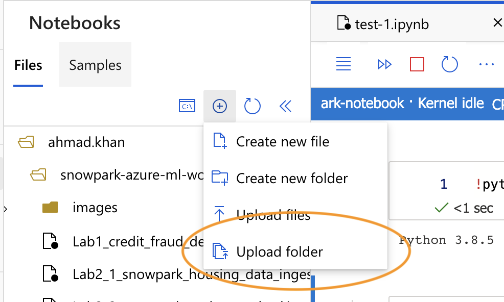
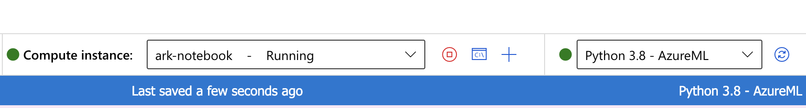

## Workshop: Data Engineering and Machine Learning Using Snowpark & Azure ML

### SETUP

1. Open the terminal and clone the workshop repository: `git clone https://github.com/filanthropic/snowpark-azure-ml-workshop`

2. Login to Azure ML Studio and select an existing workspace or create a new one: https://portal.azure.com/#home

3. From the menu on the left, click on `Compute` and create a new compute instance. Give it a name. For the instance size, a small memory intensive instance would suffice for this lab.

4. Switch over to `Notebooks` from the left menu, click on the (+) button and select `Upload folder` to upload the workshop code folder (`snowpark-azure-ml-workshop`) that you cloned in step 1. 

    

5. Create a new notebook.

6. Once, the notebook comes up, make sure the compute instance you create in step 3 is selected (and is running). Make sure to select `Python 3.8 - AzureML` as the kernel.

    

7. Install all the dependencies in the kernel by pasting this command into the first cell: `!pip install -r snowpark-azure-ml-workshop/requirements.txt`

### LAB 1: Data Engineering & Model Deployment Using Snowpark

8. Open `Lab1_credit_fraud_detector.ipynb`, select `Python 3.8 - AzureML` kernel and follow the instructions in the notebook.

### LAB 2: End-to-End ML Using Snowpark

9. Open `Lab2_1_snowpark_housing_data_ingest.ipynb`, run all cells to ingest data first and then open `Lab2_2_snowpark_end_to_end_ml.ipynb`. Again, make sure to switch to the `Python 3.8 - AzureML` kernel before you start running these notebooks.

